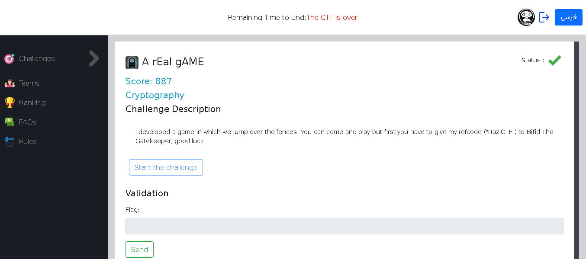
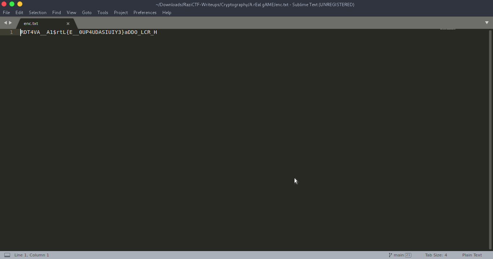
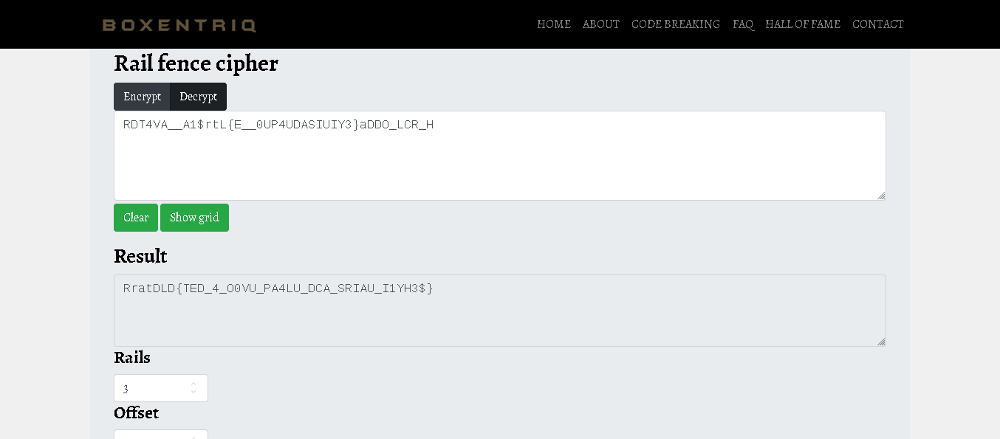
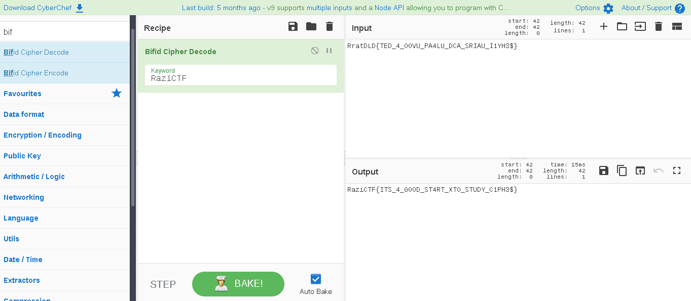

# A rEal gAME
Crypto

## Challenge




## Solution
the challenge description has 2 provided hints ```fence and bifid```

provided the cipher we try decoding it with "Rail Fence Cipher" ...
Then decode the Results with "Bifid Cipher"
with the provided key "RaziCTF"





and there we get our flag
