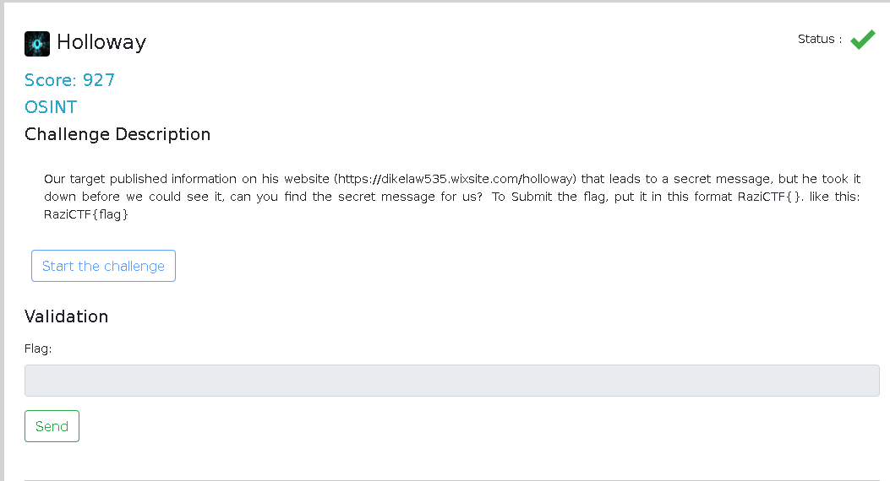
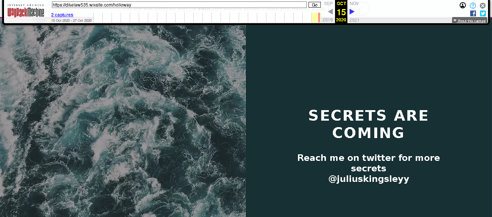
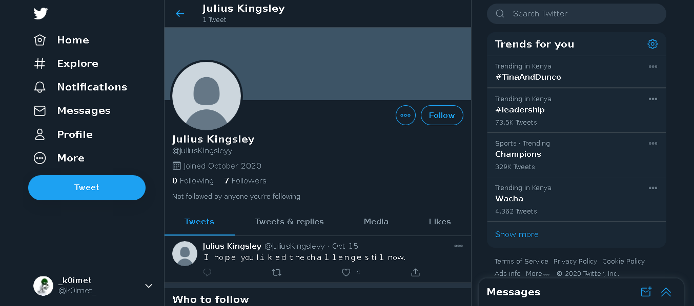
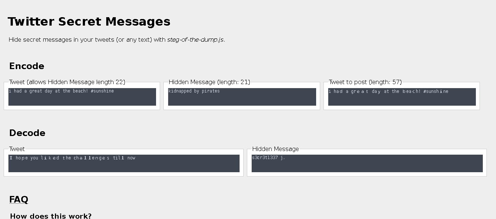

# Holloway
OSINT

## Challenge




## Solution

following the provided challenge link
```https://dikelaw535.wixsite.com/holloway```
we are met with the following web page


that ain't good :/ no Secrets yet ... hh
but again maybe it was there but deleted :)
checking through using Wayback Machine we get something


a twitter handle @juliusKingsleyy 
following the link 
```https://twitter.com/juliusKingsleyy```

we are met with the following page, just a weird looking tweet 



aha! 

the challenge name is a hint for Twitter Steganography technique. 
we decode the tweet using the site
holloway.nz/steg/

and there we get our flag 



## Flag : RaziCTF{secret1337}