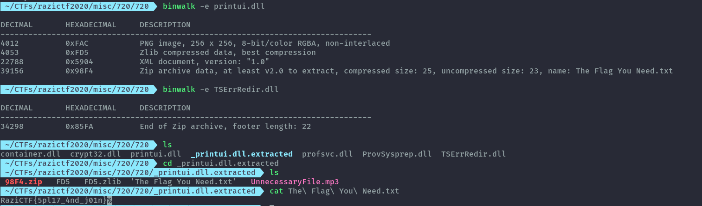

# 720

Challenge Description:

```
These files belong to Lucius. I found them in his flash drive, but I could not open them. 
Can you figure out how to open them? Please avoid opening any unnecessary and dangerous files.
```
After downloading the zip file and unzipping we get several dlls.

Since I'm on linux my go to was to check for strings in them. 
```sh
strings * | grep -i flag
```
I got two instances of ```The Flag You Need.txt```


Used grep to get the filenames then ran binwalk on both files to extract anything within them.

```sh
grep -iH 'The Flag You Need.txt' *
```


Getting the flag:



Flag: RaziCTF{5pl17_4nd_j01n}
